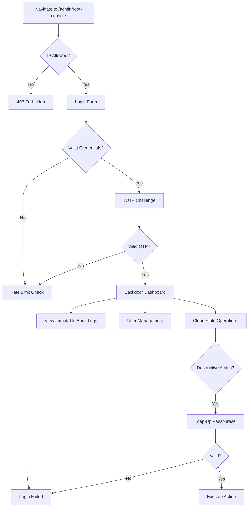
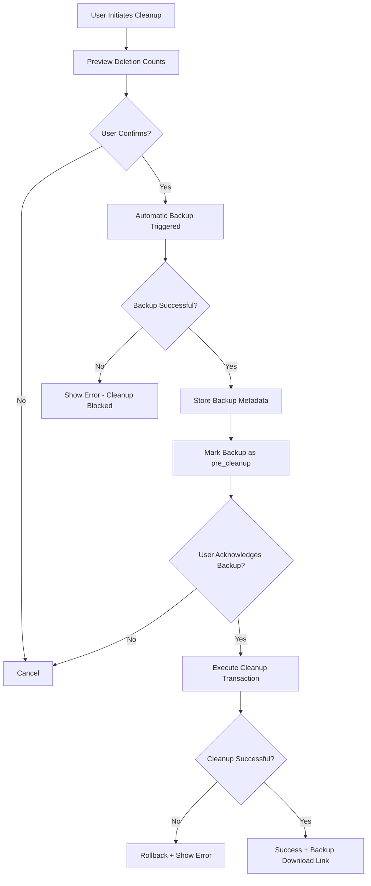
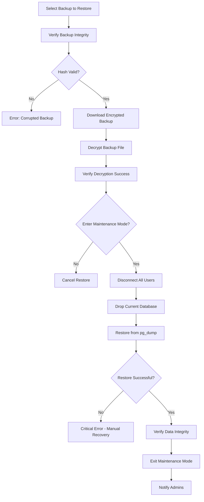
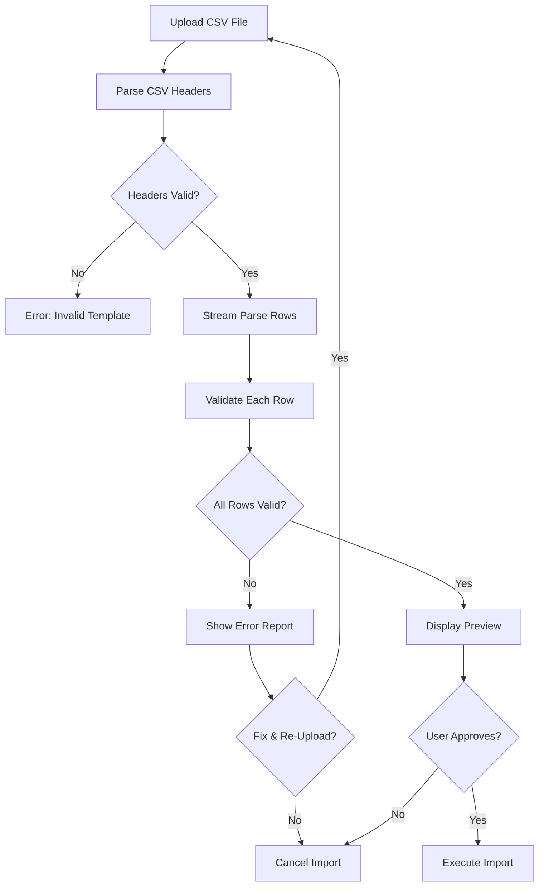

# RCCMS System Administrator Suite

## Executive Summary

The **System Administrator Suite** is an enterprise-grade administrative framework for RCCMS that provides catastrophic failure recovery, seamless data migration from legacy systems, and comprehensive disaster recovery capabilities. This suite enables rental car companies to migrate from existing software, recover from data corruption, reset test environments, and maintain complete operational control with military-grade security and audit transparency.

**Estimated Implementation Cost:** $170-260 USD (300,000 tokens)  
**Estimated Timeline:** 6-8 weeks  
**Development Effort:** 6 phases with comprehensive testing

---

## Table of Contents

1. [Overview & Business Value](#overview--business-value)
2. [Architecture & Components](#architecture--components)
3. [Backdoor Super Admin](#backdoor-super-admin)
4. [Clean Slate System (3-Tier)](#clean-slate-system-3-tier)
5. [Mandatory Backup System](#mandatory-backup-system)
6. [Bulk CSV Import System](#bulk-csv-import-system)
7. [Immutable Audit Logging](#immutable-audit-logging)
8. [Security Model](#security-model)
9. [Implementation Phases](#implementation-phases)
10. [Risk Assessment](#risk-assessment)
11. [Cost Breakdown](#cost-breakdown)

---

## Overview & Business Value

### Business Problems Solved

1. **Legacy System Migration**: Import thousands of records from existing rental software (Excel, legacy databases, competitor systems)
2. **Disaster Recovery**: Recover from catastrophic data corruption or ransomware attacks
3. **Test Environment Management**: Safely reset test/staging environments without affecting production
4. **Emergency Access**: Recover locked-out admin accounts, reset passwords during crises
5. **Regulatory Compliance**: Maintain immutable audit trails for SOC 2, ISO 27001, GDPR compliance
6. **Business Continuity**: 30-day rollback window with automated backup scheduling

### Key Features

- ✅ **Invisible Backdoor Admin**: Emergency super-user account for catastrophic scenarios
- ✅ **3-Tier Clean Slate**: Granular data reset from operational cleanup to complete system reset
- ✅ **Mandatory Pre-Cleanup Backups**: Automatic, encrypted backups before any destructive operation
- ✅ **Bulk CSV Import**: Migrate customers, vehicles, sponsors, companies, contracts, payments
- ✅ **Immutable Audit Trail**: Tamper-proof logging of all backdoor operations
- ✅ **30-Day Rollback**: One-click restoration from any backup within retention window
- ✅ **Scheduled Backups**: Automated daily/weekly backups with AES-256 encryption
- ✅ **Import Validation**: Dry-run preview, row-level error reporting, transaction rollback

---

## Architecture & Components

### New Database Tables

```typescript
// Backdoor admin flag on existing users table
users: {
  isBackdoorAdmin: boolean("is_backdoor_admin").default(false)
}

// Import job tracking
importJobs: {
  id: serial("id").primaryKey(),
  entityType: varchar("entity_type"), // customers, vehicles, contracts, etc.
  fileName: varchar("file_name"),
  fileHash: varchar("file_hash"), // SHA-256 for integrity
  status: varchar("status"), // pending, processing, completed, failed, rolled_back
  totalRows: integer("total_rows"),
  successRows: integer("success_rows"),
  errorRows: integer("error_rows"),
  errorDetails: jsonb("error_details"),
  isDryRun: boolean("is_dry_run"),
  executedBy: integer("executed_by"),
  executedAt: timestamp("executed_at"),
  completedAt: timestamp("completed_at")
}

// Backup job tracking
backupJobs: {
  id: serial("id").primaryKey(),
  backupType: varchar("backup_type"), // manual, scheduled, pre_cleanup
  fileName: varchar("file_name"),
  fileSize: integer("file_size"),
  fileHash: varchar("file_hash"),
  storageLocation: varchar("storage_location"),
  encryptionKey: varchar("encryption_key"), // encrypted AES key
  status: varchar("status"), // pending, processing, completed, failed
  triggerType: varchar("trigger_type"), // manual, scheduled, pre_cleanup
  cleanupLevel: varchar("cleanup_level"), // level_1, level_2, level_3 (for pre-cleanup backups)
  executedBy: integer("executed_by"),
  executedAt: timestamp("executed_at"),
  completedAt: timestamp("completed_at"),
  expiresAt: timestamp("expires_at"), // 30-day retention
  isRestored: boolean("is_restored"),
  restoredAt: timestamp("restored_at"),
  restoredBy: integer("restored_by")
}

// System snapshots for rollback
systemSnapshots: {
  id: serial("id").primaryKey(),
  snapshotType: varchar("snapshot_type"), // pre_cleanup, pre_import, manual
  backupJobId: integer("backup_job_id"),
  metadata: jsonb("metadata"), // what was included, counts, etc.
  createdBy: integer("created_by"),
  createdAt: timestamp("created_at")
}

// Backdoor admin audit logs (immutable, separate from regular audit logs)
backdoorAuditLogs: {
  id: serial("id").primaryKey(),
  action: varchar("action"),
  entityType: varchar("entity_type"),
  entityId: integer("entity_id"),
  details: jsonb("details"),
  ipAddress: varchar("ip_address"),
  userAgent: varchar("user_agent"),
  logHash: varchar("log_hash"), // hash chain for tamper-evidence
  previousLogHash: varchar("previous_log_hash"), // links to previous entry
  backdoorAdminId: integer("backdoor_admin_id"),
  createdAt: timestamp("created_at").notNull()
}
```

### API Endpoints

```typescript
// Backdoor Admin Routes (protected by special middleware)
POST   /api/backdoor/auth/login           // Step 1: Username/password
POST   /api/backdoor/auth/step-up         // Step 2: OTP verification
GET    /api/backdoor/auth/verify          // Verify session
POST   /api/backdoor/auth/logout          // End session

// User Management
POST   /api/backdoor/users/reset-password // Reset any user's password
GET    /api/backdoor/users/list           // List all users (including disabled)

// Clean Slate Operations
GET    /api/backdoor/cleanup/preview      // Preview what will be deleted (Level 1/2/3)
POST   /api/backdoor/cleanup/execute      // Execute cleanup (requires backup first)
GET    /api/backdoor/cleanup/status       // Check cleanup job status

// Backup & Restore
POST   /api/backdoor/backup/create        // Manual backup creation
GET    /api/backdoor/backup/list          // List all backups
GET    /api/backdoor/backup/download/:id  // Download backup (signed URL)
POST   /api/backdoor/backup/restore/:id   // Restore from backup
POST   /api/backdoor/backup/schedule      // Configure scheduled backups
GET    /api/backdoor/backup/verify/:id    // Verify backup integrity

// Bulk Import
POST   /api/backdoor/import/upload        // Upload CSV file
POST   /api/backdoor/import/validate      // Dry-run validation
POST   /api/backdoor/import/execute       // Execute import
GET    /api/backdoor/import/status/:id    // Check import progress
POST   /api/backdoor/import/rollback/:id  // Rollback failed import
GET    /api/backdoor/import/templates     // Download CSV templates

// Immutable Audit Logs (read-only)
GET    /api/backdoor/audit/logs           // View backdoor operations
GET    /api/backdoor/audit/verify-chain   // Verify hash chain integrity
```

---

## Backdoor Super Admin

### Purpose

Emergency access account for catastrophic scenarios:
- Regular admin accounts locked out or compromised
- Database corruption requiring surgical intervention
- Forgotten superadmin password
- Security incident requiring immediate action
- Emergency system reset for new deployment

### Key Characteristics

1. **Invisible**: Not shown in Users list, Settings pages, or regular admin interfaces
2. **Immutable**: Cannot be deleted, disabled, or modified by regular admins
3. **Separate UI**: Dedicated interface at `/admin/root-console` (hidden route)
4. **Separate Audit Trail**: All actions logged in isolated, immutable `backdoorAuditLogs` table
5. **Environment-Configured**: Credentials stored in environment variables, not database

### Authentication Flow

**Step 1: Username + Password**
```typescript
// Environment variables
BACKDOOR_USERNAME=root_admin
BACKDOOR_PASSWORD_HASH=bcrypt_hash_here
BACKDOOR_IP_ALLOWLIST=192.168.1.0/24,10.0.0.0/8
```

**Step 2: TOTP (Time-based One-Time Password)**
```typescript
// Offline TOTP seed stored in environment
BACKDOOR_TOTP_SECRET=base32_secret_here
```

**Step 3: Step-Up Authentication** (for destructive operations)
```typescript
// Additional passphrase required for:
// - Password resets
// - Clean slate operations
// - Backup restores
BACKDOOR_STEPUP_PASSPHRASE=emergency_override_phrase
```

### Security Mechanisms

1. **IP Allowlist**: Restrict access to specific IP ranges (office, VPN)
2. **Rate Limiting**: Max 3 failed login attempts per hour (exponential backoff)
3. **Session Timeout**: 15-minute idle timeout, 1-hour max session
4. **MFA Required**: TOTP mandatory for all access
5. **Step-Up Auth**: Separate passphrase for destructive operations
6. **Audit Logging**: Every action logged with tamper-evident hash chain
7. **Kill Switch**: `BACKDOOR_ENABLED=false` completely disables access

### Access Flow



### Backdoor Dashboard UI

**Left Navigation:**
- 🏠 Dashboard
- 👥 User Management (reset passwords)
- 🗑️ Clean Slate Operations
- 💾 Backup & Restore
- 📥 Bulk Import
- 📋 Immutable Audit Logs (read-only)
- ⚙️ System Configuration

**Dashboard Overview:**
- Last backup status
- Scheduled backup health
- Recent backdoor actions (from immutable logs)
- System health indicators
- Quick actions (backup now, view logs)

---

## Clean Slate System (3-Tier)

### Tiered Deletion Levels

The clean slate system offers **3 levels** of data cleanup to balance operational needs with safety:

#### **Level 1: Operational Data Only** (Safest)

**Purpose:** Reset rental operations while preserving all configuration and master data.

**Use Cases:**
- Clearing test rentals before going live
- Removing training/demo data
- Starting fresh operational period (new fiscal year)

**What Gets Deleted:**
- ✅ All contracts (all statuses)
- ✅ All payments
- ✅ All vehicle inspections
- ✅ All contract edits (audit trail)
- ✅ Business operations audit logs

**What Is Preserved:**
- ✅ Superadmin account
- ✅ Backdoor admin account
- ✅ All regular users (Admin, Manager, Staff, Viewer)
- ✅ Company settings (name, logo, tax info, clauses)
- ✅ Financial settings (rates, fees, fuel pricing)
- ✅ Master data: Customers, Vehicles, Sponsors, Companies
- ✅ System audit logs
- ✅ System errors
- ✅ Backdoor audit logs (immutable)

**Confirmation Required:** Type "CLEAN OPERATIONS"

**Typical Timeline:** 2-5 seconds

---

#### **Level 2: Operational + Master Data** (Moderate)

**Purpose:** Reset all business data while preserving system configuration and users.

**Use Cases:**
- Company changing business model (switching from daily to monthly rentals)
- Selling software to new rental company (clear previous company's data)
- Major data corruption requiring fresh start
- Testing full onboarding workflow

**What Gets Deleted:**
- ✅ Everything from Level 1 PLUS:
- ✅ All customers
- ✅ All vehicles
- ✅ All sponsors (individual)
- ✅ All companies (corporate sponsors)

**What Is Preserved:**
- ✅ Superadmin account
- ✅ Backdoor admin account
- ✅ All regular users (Admin, Manager, Staff, Viewer)
- ✅ Company settings (name, logo, tax info, clauses)
- ✅ Financial settings (rates, fees, fuel pricing)
- ✅ System audit logs
- ✅ System errors
- ✅ Backdoor audit logs (immutable)

**Confirmation Required:** Type "RESET MASTER DATA"

**Typical Timeline:** 5-15 seconds

---

#### **Level 3: Complete System Reset** (Severe)

**Purpose:** Nuclear option - reset everything except admin accounts.

**Use Cases:**
- Complete redeployment to different company
- Catastrophic data corruption across all tables
- Security breach requiring data purge
- Major system reconfiguration

**What Gets Deleted:**
- ✅ Everything from Level 2 PLUS:
- ✅ All regular users (Admin, Manager, Staff, Viewer)
- ✅ Company settings (name, logo, tax info, clauses)
- ✅ Financial settings (rates, fees, fuel pricing)
- ✅ System audit logs
- ✅ System errors

**What Is Preserved:**
- ✅ Superadmin account (unchanged)
- ✅ Backdoor admin account (unchanged)
- ✅ Backdoor audit logs (immutable - never deleted)
- ✅ Database schema (tables remain)

**Confirmation Required:**
1. Type "COMPLETE SYSTEM RESET"
2. Enter step-up passphrase
3. Wait 10-second countdown

**Typical Timeline:** 15-30 seconds

---

### Mandatory Pre-Cleanup Backup

**CRITICAL RULE:** No cleanup can proceed without a successful backup.

**Backup Flow:**


**Backup Requirements:**
1. **Atomic**: Backup and cleanup must succeed/fail together
2. **Verified**: SHA-256 hash verification after backup completes
3. **Encrypted**: AES-256 encryption with secure key storage
4. **Tagged**: Marked as `pre_cleanup` with cleanup level metadata
5. **Downloadable**: User receives immediate download link
6. **Retained**: Protected from deletion for 30 days (immune to cleanup)
7. **Logged**: All backup operations logged in immutable backdoor audit logs

**Backup Failure Handling:**
- Storage full: Alert user, cleanup blocked
- Network error: Retry 3 times, then block cleanup
- Hash mismatch: Discard backup, block cleanup, alert admin
- Encryption error: Block cleanup, log security event

---

### Cleanup Execution

**Transaction Guarantees:**
```typescript
// Pseudo-code for cleanup transaction
BEGIN TRANSACTION;
  
  // 1. Verify backup exists and is valid
  const backup = await verifyPreCleanupBackup(cleanupLevel);
  if (!backup.valid) {
    ROLLBACK;
    throw new Error('Backup verification failed');
  }
  
  // 2. Create system snapshot
  const snapshot = await createSystemSnapshot({
    type: 'pre_cleanup',
    backupJobId: backup.id,
    cleanupLevel
  });
  
  // 3. Execute cleanup in correct order (respect foreign keys)
  if (cleanupLevel >= 1) {
    await db.delete(contractEdits);
    await db.delete(vehicleInspections);
    await db.delete(payments);
    await db.delete(contracts);
    await db.delete(auditLogs).where(eq(auditLogs.category, 'business_ops'));
  }
  
  if (cleanupLevel >= 2) {
    await db.delete(companies);
    await db.delete(sponsors);
    await db.delete(vehicles);
    await db.delete(customers);
  }
  
  if (cleanupLevel >= 3) {
    await db.delete(users).where(
      and(
        eq(users.isSuperAdmin, false),
        eq(users.isBackdoorAdmin, false)
      )
    );
    await db.delete(companySettings);
    await db.delete(financialSettings);
    await db.delete(auditLogs).where(eq(auditLogs.category, 'system'));
    await db.delete(systemErrors);
  }
  
  // 4. Log cleanup completion (immutable)
  await logBackdoorAction({
    action: 'cleanup_completed',
    details: { level: cleanupLevel, snapshotId: snapshot.id }
  });
  
COMMIT;
```

**Foreign Key Handling:**
Deletion order respects dependencies:
1. Contract edits (references contracts)
2. Vehicle inspections (references contracts)
3. Payments (references contracts)
4. Contracts (references customers, vehicles, sponsors, companies)
5. Companies, Sponsors (independent)
6. Vehicles (independent)
7. Customers (independent)
8. Users (after all references cleared)

---

## Mandatory Backup System

### Backup Types

1. **Manual Backups**: Triggered by backdoor admin on-demand
2. **Scheduled Backups**: Automated daily/weekly backups
3. **Pre-Cleanup Backups**: Mandatory before any cleanup operation
4. **Pre-Import Backups**: Optional before bulk imports (recommended)

### Backup Technology

**PostgreSQL pg_dump Integration:**
```bash
# Full database dump with custom format (compressed, parallel)
pg_dump \
  --dbname=$DATABASE_URL \
  --format=custom \
  --compress=9 \
  --jobs=4 \
  --file=/tmp/backup_$(date +%s).dump
```

**Encryption:**
```bash
# AES-256 encryption using OpenSSL
openssl enc -aes-256-cbc \
  -salt \
  -in backup.dump \
  -out backup.dump.enc \
  -pass file:encryption_key.txt
```

### Storage Strategy

**Development Environment (Neon):**
- Store encrypted backups in `/tmp/backups/` directory
- Provide immediate download links (signed URLs, 24-hour expiry)
- Automatic cleanup after 30 days

**Production Environment:**
- **Option 1**: S3/MinIO object storage (recommended)
- **Option 2**: SFTP to external backup server
- **Option 3**: Download to client machine (manual process)

### Scheduled Backups

**Implementation Using node-cron:**
```typescript
import cron from 'node-cron';

// Daily backup at 2 AM UTC
cron.schedule('0 2 * * *', async () => {
  await createBackup({
    type: 'scheduled',
    triggerType: 'daily'
  });
});

// Weekly full backup on Sunday at 3 AM UTC
cron.schedule('0 3 * * 0', async () => {
  await createBackup({
    type: 'scheduled',
    triggerType: 'weekly'
  });
});
```

**Neon Serverless Considerations:**
- Serverless environments may not support persistent cron jobs
- **Solution 1**: External cron service hits webhook endpoint
- **Solution 2**: GitHub Actions scheduled workflow
- **Solution 3**: Replit Deployments with scheduled tasks

### Backup Retention Policy

**30-Day Rolling Window:**
- Daily backups retained for 30 days
- Weekly backups retained for 90 days (optional)
- Pre-cleanup backups protected from auto-deletion (flagged `retainIndefinitely: true`)
- Manual backups follow 30-day retention unless flagged

**Storage Monitoring:**
- Alert when storage reaches 80% capacity
- Block new backups when storage exceeds 95%
- Automatic cleanup of expired backups

### Restore Procedure

**Restoration Flow:**


**Restoration Command:**
```bash
# Decrypt backup
openssl enc -aes-256-cbc -d \
  -in backup.dump.enc \
  -out backup.dump \
  -pass file:encryption_key.txt

# Restore database
pg_restore \
  --dbname=$DATABASE_URL \
  --clean \
  --if-exists \
  --jobs=4 \
  backup.dump
```

**Safety Mechanisms:**
1. **Maintenance Mode**: System enters read-only mode during restore
2. **Verification**: Post-restore integrity checks (record counts, foreign keys)
3. **Rollback**: If restore fails, attempt to restore from previous known-good backup
4. **Notification**: Email all admins when restore completes

---

## Bulk CSV Import System

### Supported Entity Types

1. **Customers** (`customers_import_template.csv`)
2. **Vehicles** (`vehicles_import_template.csv`)
3. **Sponsors** (`sponsors_import_template.csv`)
4. **Companies** (`companies_import_template.csv`)
5. **Contracts** (`contracts_import_template.csv`)
6. **Payments** (`payments_import_template.csv`)

### CSV vs SQL: Why CSV?

**CSV Advantages:**
| Factor | CSV | SQL Dump |
|--------|-----|----------|
| **Security** | ✅ No SQL injection risk | ⚠️ Vulnerable to malicious SQL |
| **Portability** | ✅ Works across all databases | ⚠️ Database-specific syntax |
| **Human-Readable** | ✅ Easy to review in Excel/Sheets | ❌ Binary or complex format |
| **Validation** | ✅ Row-level error reporting | ❌ All-or-nothing approach |
| **Bilingual Support** | ✅ Handles EN/AR in separate columns | ⚠️ Encoding issues |
| **Partial Import** | ✅ Skip bad rows, continue | ❌ Transaction fails completely |
| **Audit Trail** | ✅ Track exactly what was imported | ⚠️ Opaque bulk operation |
| **User-Friendly** | ✅ Non-technical users can prepare | ❌ Requires DBA knowledge |

**Recommendation:** **CSV is strongly preferred** for data migration scenarios.

### Import Workflow

**Phase 1: Upload & Validation**


**Phase 2: Dry-Run Preview**
- Show first 10 rows with validation status
- Display row-level errors with field names
- Show summary: Total rows, valid rows, invalid rows
- Highlight warnings (e.g., duplicate phone numbers)

**Phase 3: Execution**
- Batch processing (500 rows per transaction)
- Real-time progress indicator (e.g., "Processing row 1,234 of 5,678")
- Transaction rollback on critical errors
- Partial success option: "Skip bad rows and continue"

### Validation Rules

**Customers:**
```typescript
// Required fields
- national_id: string (unique)
- name_en: string
- name_ar: string
- nationality: string
- phone: string (duplicate warning only)
- license_number: string

// Optional fields
- email: string (valid email format)
- address_en, address_ar: string

// Validation
- Phone: Must match format (e.g., +966xxxxxxxxx)
- Email: Valid email regex
- National ID: No duplicates allowed
```

**Vehicles:**
```typescript
// Required fields
- plate_number: string (unique)
- brand_en, brand_ar: string
- model_en, model_ar: string
- year: integer (1900-current year)
- color_en, color_ar: string
- fuel_type: enum (petrol, diesel, electric, hybrid)
- tank_capacity_liters: decimal

// Optional fields
- chassis_number: string
- registration_expiry: date (ISO 8601)

// Validation
- Plate number: Unique across system
- Year: Reasonable range
- Fuel type: Must match enum values
```

**Contracts:**
```typescript
// Required fields
- customer_id_or_national_id: string (lookup customer)
- vehicle_id_or_plate: string (lookup vehicle)
- rental_start_date: date (ISO 8601)
- rental_end_date: date (ISO 8601)
- daily_rate: decimal
- hirer_type: enum (direct, with_sponsor, from_company)

// Conditional fields
- sponsor_id_or_national_id: required if hirer_type=with_sponsor
- company_id_or_tax_id: required if hirer_type=from_company

// Optional fields
- discount, deposit, addons (JSON array)

// Validation
- Date logic: end_date > start_date
- Customer exists: Lookup by national_id
- Vehicle exists: Lookup by plate_number
- Sponsor/Company exists if required
```

### Referential Integrity Handling

**External ID Mapping:**
CSV can reference entities using external identifiers:

```csv
customer_national_id,vehicle_plate,rental_start_date,rental_end_date
1234567890,ABC-1234,2025-01-01,2025-01-07
```

**Lookup Logic:**
```typescript
// During import, resolve external IDs to internal IDs
const customer = await db.query.customers.findFirst({
  where: eq(customers.nationalId, row.customer_national_id)
});

if (!customer) {
  errors.push(`Customer with National ID ${row.customer_national_id} not found`);
}

const vehicle = await db.query.vehicles.findFirst({
  where: eq(vehicles.plateNumber, row.vehicle_plate)
});

if (!vehicle) {
  errors.push(`Vehicle with plate ${row.vehicle_plate} not found`);
}
```

**Import Order Dependencies:**
1. Import Customers first (independent)
2. Import Vehicles second (independent)
3. Import Sponsors third (independent)
4. Import Companies fourth (independent)
5. Import Contracts fifth (depends on customers, vehicles, sponsors, companies)
6. Import Payments last (depends on contracts)

### Bilingual Data Handling

**Approach 1: Separate Columns (Recommended)**
```csv
name_en,name_ar,address_en,address_ar
"Ahmed Al-Rashid","أحمد الراشد","123 King St","123 شارع الملك"
```

**Approach 2: JSON in Single Column** (Not Recommended)
```csv
name,address
"{""en"":""Ahmed"",""ar"":""أحمد""}","{""en"":""123 King St"",""ar"":""123 شارع الملك""}"
```

**Character Encoding:**
- **Mandatory**: UTF-8 with BOM
- **Validation**: Check for invalid characters on upload
- **Error Handling**: Reject files with encoding issues

### Error Reporting

**Row-Level Error Format:**
```json
{
  "row": 47,
  "errors": [
    {
      "field": "phone",
      "error": "Invalid phone format. Expected: +966xxxxxxxxx"
    },
    {
      "field": "rental_end_date",
      "error": "End date must be after start date"
    }
  ],
  "warnings": [
    {
      "field": "phone",
      "warning": "Duplicate phone number found. Customer may already exist."
    }
  ]
}
```

**Summary Report:**
```json
{
  "fileName": "customers_import_2025-01-15.csv",
  "totalRows": 1234,
  "validRows": 1180,
  "invalidRows": 54,
  "warnings": 23,
  "status": "completed_with_errors",
  "executionTime": "12.5s",
  "downloadErrorReport": "/api/backdoor/import/errors/456.csv"
}
```

### Rollback Capability

**Automatic Rollback Triggers:**
- Critical error during batch processing
- Foreign key constraint violation
- Database transaction timeout
- User cancels import mid-process

**Manual Rollback:**
```typescript
// Tag all imported records with import job ID
INSERT INTO customers (..., import_job_id) VALUES (..., 123);

// Rollback: Delete all records from specific import
DELETE FROM customers WHERE import_job_id = 123;
```

**Rollback Window:** 24 hours after import completion

---

## Immutable Audit Logging

### Purpose

Backdoor admin actions require **tamper-proof audit trail** for:
- Security compliance (SOC 2, ISO 27001)
- Forensic investigation after security incidents
- Regulatory requirements (financial institutions)
- Proving integrity in legal disputes

### Immutability Mechanisms

**1. Separate Table (Never Truncated/Deleted)**
```typescript
// backdoorAuditLogs table is NEVER affected by cleanup operations
// Even Level 3 (Complete System Reset) preserves these logs
```

**2. Hash Chain (Blockchain-Style)**
```typescript
// Each log entry contains:
logHash: SHA256(action + details + timestamp + previousLogHash)
previousLogHash: logHash of previous entry

// First entry in chain:
previousLogHash: "GENESIS"

// Tampering detection:
function verifyLogChain() {
  const logs = await db.query.backdoorAuditLogs.findMany({
    orderBy: asc(backdoorAuditLogs.id)
  });
  
  for (let i = 1; i < logs.length; i++) {
    const expectedHash = sha256(
      logs[i].action +
      JSON.stringify(logs[i].details) +
      logs[i].createdAt.toISOString() +
      logs[i-1].logHash
    );
    
    if (logs[i].logHash !== expectedHash) {
      return {
        valid: false,
        tamperedAt: logs[i].id,
        error: "Hash chain broken - tampering detected"
      };
    }
  }
  
  return { valid: true };
}
```

**3. Database Triggers (Write-Only)**
```sql
-- Prevent UPDATE or DELETE on backdoor audit logs
CREATE TRIGGER prevent_audit_log_modification
BEFORE UPDATE OR DELETE ON backdoor_audit_logs
FOR EACH ROW
EXECUTE FUNCTION prevent_modification();

CREATE FUNCTION prevent_modification() RETURNS TRIGGER AS $$
BEGIN
  RAISE EXCEPTION 'Audit logs are immutable and cannot be modified or deleted';
END;
$$ LANGUAGE plpgsql;
```

**4. Append-Only Storage**
```typescript
// Only INSERT operations allowed
await db.insert(backdoorAuditLogs).values({
  action: 'password_reset',
  entityType: 'user',
  entityId: 42,
  details: { targetUser: 'admin@example.com', reason: 'Account locked' },
  ipAddress: req.ip,
  userAgent: req.headers['user-agent'],
  previousLogHash: lastLog.logHash,
  logHash: calculateHash(...),
  backdoorAdminId: session.backdoorAdminId,
  createdAt: new Date()
});
```

### Logged Actions

**Authentication Events:**
- `backdoor_login_success`
- `backdoor_login_failed`
- `backdoor_logout`
- `backdoor_session_expired`
- `stepup_auth_success`
- `stepup_auth_failed`

**User Management:**
- `password_reset` (includes target user ID, reason)
- `user_viewed` (which user was accessed)

**Clean Slate Operations:**
- `cleanup_preview_requested` (level, expected deletions)
- `cleanup_initiated` (level, backup ID)
- `cleanup_completed` (level, actual deletions, duration)
- `cleanup_failed` (level, error details)

**Backup Operations:**
- `backup_created` (type, size, hash)
- `backup_downloaded` (backup ID, download count)
- `backup_restored` (backup ID, pre-restore snapshot)
- `backup_deleted` (backup ID, reason)

**Import Operations:**
- `import_uploaded` (entity type, file name, row count)
- `import_validated` (job ID, validation results)
- `import_executed` (job ID, success/error counts)
- `import_rolled_back` (job ID, reason)

**System Configuration:**
- `scheduled_backup_configured` (schedule details)
- `retention_policy_updated` (old vs new values)
- `kill_switch_activated` (reason)

### UI Presentation

**Backdoor Dashboard > Audit Logs Tab:**

```typescript
// Read-only interface, no edit/delete buttons
<AuditLogViewer>
  <Filters>
    - Date range picker
    - Action type dropdown (all actions, auth, cleanup, backup, import)
    - Search by entity ID
  </Filters>
  
  <LogTimeline>
    {logs.map(log => (
      <LogEntry key={log.id}>
        <Timestamp>{log.createdAt}</Timestamp>
        <Icon action={log.action} /> {/* Different icons for different actions */}
        <ActionDescription>
          {formatAction(log.action, log.details)}
          {/* e.g., "Password reset for user admin@example.com (reason: Account locked)" */}
        </ActionDescription>
        <Metadata>
          IP: {log.ipAddress} | Browser: {parseUserAgent(log.userAgent)}
        </Metadata>
        <HashBadge verified={log.hashVerified}>
          Hash: {log.logHash.substring(0, 16)}...
        </HashBadge>
      </LogEntry>
    ))}
  </LogTimeline>
  
  <VerifyIntegrityButton onClick={verifyHashChain}>
    🔒 Verify Log Integrity
  </VerifyIntegrityButton>
</AuditLogViewer>
```

**Visual Design:**
- **Timeline Layout**: Chronological display, newest first
- **Color Coding**: Green (success), Red (failed), Yellow (warning), Blue (info)
- **Icons**: Lock icon for auth, trash for cleanup, cloud for backup, upload for import
- **Hash Verification**: Green checkmark if chain valid, red alert if tampered
- **Export**: Download as PDF or JSON for external audit

**Access Control:**
- **Backdoor Admin**: Full read access to all backdoor logs
- **Regular Admins**: NO ACCESS to backdoor logs (completely hidden)
- **System Audit Logs**: Separate table for regular admin actions (existing `auditLogs`)

---

## Security Model

### Defense-in-Depth Layers

**Layer 1: Network Security**
- IP allowlist (environment-configured ranges)
- Rate limiting (3 failed attempts per hour)
- DDoS protection (Cloudflare/similar)

**Layer 2: Authentication**
- Username + bcrypt password (12+ rounds)
- TOTP (30-second window, no backup codes)
- Session tokens (httpOnly, secure, sameSite)

**Layer 3: Authorization**
- Role check: `isBackdoorAdmin === true`
- Route protection: `/admin/root-console/*` requires backdoor session
- Step-up authentication for destructive operations

**Layer 4: Audit & Monitoring**
- Immutable hash-chained audit logs
- Real-time alerting on suspicious activity
- Log export for SIEM integration

**Layer 5: Data Protection**
- Encrypted backups (AES-256)
- Encrypted sensitive fields in database
- Secure deletion (overwrite before cleanup)

### Threat Model & Mitigations

| Threat | Mitigation |
|--------|------------|
| **Brute Force Attack** | Rate limiting, IP allowlist, exponential backoff |
| **Session Hijacking** | Short session timeout, httpOnly cookies, CSRF tokens |
| **Credential Theft** | TOTP required, no password reset for backdoor admin |
| **Insider Threat** | Immutable audit logs, step-up auth, hash chain verification |
| **SQL Injection** | Parameterized queries, Drizzle ORM protection |
| **Backup Tampering** | SHA-256 hash verification, encrypted storage |
| **Audit Log Tampering** | Hash chain, database triggers, append-only design |
| **Privilege Escalation** | Separate backdoor flag, no role inheritance |
| **Data Exfiltration** | Audit all backup downloads, rate limit exports |

### Compliance Features

**SOC 2 Type II:**
- ✅ Immutable audit trail
- ✅ Separation of duties (backdoor vs regular admin)
- ✅ Access logging and monitoring
- ✅ Encrypted data at rest (backups)

**ISO 27001:**
- ✅ Access control matrix
- ✅ Incident response capability (emergency access)
- ✅ Data backup and recovery procedures
- ✅ Security event logging

**GDPR:**
- ✅ Right to erasure (cleanup functionality)
- ✅ Data portability (CSV export)
- ✅ Audit trail for data processing
- ⚠️ Backup retention vs right to be forgotten (consult legal counsel)

---

## Implementation Phases

### Phase 1: Core Infrastructure (Week 1-2)

**Database Schema:**
- [ ] Add `isBackdoorAdmin` flag to `users` table
- [ ] Create `backdoorAuditLogs` table with hash chain
- [ ] Create `backupJobs` table
- [ ] Create `importJobs` table
- [ ] Create `systemSnapshots` table
- [ ] Add database triggers for immutability

**Authentication System:**
- [ ] Environment variable configuration (`BACKDOOR_USERNAME`, `BACKDOOR_PASSWORD_HASH`, `BACKDOOR_TOTP_SECRET`)
- [ ] Backdoor login API endpoint (username + password)
- [ ] TOTP verification API endpoint
- [ ] Step-up authentication API endpoint
- [ ] IP allowlist middleware
- [ ] Rate limiting middleware
- [ ] Session management (dedicated session store)

**Audit Logging:**
- [ ] `logBackdoorAction()` helper function
- [ ] Hash chain calculation logic
- [ ] Hash chain verification function
- [ ] Database triggers to prevent modification

**Testing:**
- [ ] Unit tests for authentication flow
- [ ] Unit tests for hash chain verification
- [ ] Integration tests for audit logging
- [ ] Security tests (brute force, session hijacking)

**Deliverables:**
- Backdoor admin can log in securely
- All actions logged with tamper-proof hash chain
- Hash chain verification works correctly

---

### Phase 2: Backup System (Week 2-3)

**Backup Creation:**
- [ ] `createBackup()` service function
- [ ] `pg_dump` integration (subprocess execution)
- [ ] AES-256 encryption implementation
- [ ] SHA-256 hash calculation
- [ ] Storage management (local `/tmp/` or S3)
- [ ] Backup metadata storage in `backupJobs` table

**Backup Management:**
- [ ] List backups API endpoint
- [ ] Download backup API endpoint (signed URLs)
- [ ] Verify backup integrity API endpoint
- [ ] Delete expired backups (cron job)
- [ ] Storage quota monitoring

**Scheduled Backups:**
- [ ] Node-cron integration
- [ ] Scheduled backup configuration API
- [ ] Backup failure notification system
- [ ] Retry logic for failed backups

**Restore Functionality:**
- [ ] Restore backup API endpoint
- [ ] Maintenance mode toggle
- [ ] `pg_restore` integration
- [ ] Post-restore integrity verification
- [ ] Rollback on restore failure

**Testing:**
- [ ] Backup creation tests (small database)
- [ ] Encryption/decryption tests
- [ ] Hash verification tests
- [ ] Restore tests (with test database)
- [ ] Scheduled backup tests

**Deliverables:**
- Manual backups work end-to-end
- Backups are encrypted and verified
- Restore procedure successfully recovers data
- Scheduled backups run automatically

---

### Phase 3: Clean Slate System (Week 3-4)

**Cleanup Logic:**
- [ ] `cleanupLevel1()` service function (operational data only)
- [ ] `cleanupLevel2()` service function (operational + master data)
- [ ] `cleanupLevel3()` service function (complete reset)
- [ ] Foreign key-aware deletion order
- [ ] Transaction management with rollback
- [ ] Mandatory pre-cleanup backup trigger

**Preview Functionality:**
- [ ] `previewCleanup()` function (count records to be deleted)
- [ ] Preview API endpoint
- [ ] Detailed breakdown by entity type

**Execution Flow:**
- [ ] Cleanup initiation API endpoint
- [ ] User confirmation handling (typed phrases)
- [ ] Step-up authentication integration
- [ ] Progress tracking (background job)
- [ ] Cleanup status API endpoint

**Safety Mechanisms:**
- [ ] Verify backup exists before cleanup
- [ ] Atomic backup + cleanup transaction
- [ ] Backup download link generation
- [ ] Cleanup rollback on failure
- [ ] Post-cleanup verification

**Testing:**
- [ ] Level 1 cleanup tests (verify preservations)
- [ ] Level 2 cleanup tests (verify preservations)
- [ ] Level 3 cleanup tests (verify superadmin preserved)
- [ ] Backup failure blocks cleanup test
- [ ] Foreign key integrity tests

**Deliverables:**
- All 3 cleanup levels work correctly
- Mandatory backup enforced before cleanup
- Correct data preserved at each level
- Cleanup can be safely rolled back

---

### Phase 4: CSV Import System (Week 4-6)

**CSV Templates:**
- [ ] Create `templates/customers_import_template.csv`
- [ ] Create `templates/vehicles_import_template.csv`
- [ ] Create `templates/sponsors_import_template.csv`
- [ ] Create `templates/companies_import_template.csv`
- [ ] Create `templates/contracts_import_template.csv`
- [ ] Create `templates/payments_import_template.csv`
- [ ] Template download API endpoint

**Import Pipeline:**
- [ ] CSV upload API endpoint (multipart file upload)
- [ ] Streaming CSV parser (handle large files)
- [ ] Row-by-row validation logic
- [ ] External ID resolution (national_id → customer_id, plate → vehicle_id)
- [ ] Bilingual data handling (UTF-8 validation)
- [ ] Referential integrity checks

**Dry-Run & Preview:**
- [ ] Dry-run validation API endpoint
- [ ] Error report generation (row-level errors)
- [ ] Preview display (first 10 rows)
- [ ] Summary statistics (valid/invalid counts)

**Execution:**
- [ ] Import execution API endpoint
- [ ] Batch processing (500 rows per transaction)
- [ ] Progress tracking (background job)
- [ ] Import status API endpoint
- [ ] Partial success handling (skip bad rows option)

**Rollback:**
- [ ] Tag imported records with `import_job_id`
- [ ] Rollback API endpoint (delete by job ID)
- [ ] 24-hour rollback window enforcement

**Testing:**
- [ ] CSV parsing tests (valid/invalid formats)
- [ ] Validation tests (all entity types)
- [ ] Referential integrity tests
- [ ] Bilingual data tests (Arabic characters)
- [ ] Large file tests (10,000+ rows)
- [ ] Import rollback tests

**Deliverables:**
- CSV templates available for download
- Import validation catches all errors
- Successful import of all entity types
- Rollback works correctly
- Progress tracking visible during import

---

### Phase 5: Backdoor UI Implementation (Week 6-7)

**Route & Layout:**
- [ ] Create `/admin/root-console` route (hidden from navigation)
- [ ] Backdoor layout component (separate from main app)
- [ ] Login page (username + password + TOTP)
- [ ] Step-up authentication modal

**Dashboard:**
- [ ] Dashboard overview page
- [ ] Last backup status widget
- [ ] Recent actions timeline
- [ ] System health indicators
- [ ] Quick action buttons

**User Management:**
- [ ] User list page (shows all users including disabled)
- [ ] Password reset form (with reason field)
- [ ] Step-up confirmation dialog

**Clean Slate Interface:**
- [ ] Cleanup level selector
- [ ] Preview deletion counts
- [ ] Confirmation dialog (typed phrases)
- [ ] Step-up passphrase input
- [ ] Progress indicator
- [ ] Backup download link display

**Backup Management:**
- [ ] Backup list page (sortable, filterable)
- [ ] Manual backup creation button
- [ ] Download backup button (signed URLs)
- [ ] Restore backup dialog (with warnings)
- [ ] Schedule configuration page

**Import Management:**
- [ ] CSV template download buttons
- [ ] File upload interface (drag & drop)
- [ ] Validation results display
- [ ] Error report viewer
- [ ] Import execution button
- [ ] Progress tracker
- [ ] Rollback button

**Audit Logs:**
- [ ] Immutable audit log timeline
- [ ] Filter controls (date, action type)
- [ ] Hash verification button
- [ ] Hash chain status indicator
- [ ] Export to PDF/JSON

**Testing:**
- [ ] UI component tests (React Testing Library)
- [ ] E2E tests (Playwright - full workflows)
- [ ] Accessibility tests (WCAG 2.1 AA)
- [ ] RTL layout tests (Arabic mode)

**Deliverables:**
- Fully functional backdoor admin UI
- All features accessible via intuitive interface
- Responsive design (desktop + tablet)
- Bilingual support (English + Arabic)

---

### Phase 6: Documentation & Testing (Week 7-8)

**Documentation Updates:**
- [ ] Create `SYSTEM_ADMINISTRATOR_SUITE.md` (this document)
- [ ] Create `SYSTEM_ADMIN_FEATURE_SUMMARY.md`
- [ ] Update `MISSING_FEATURES.md`
- [ ] Update `replit.md`
- [ ] Update `ADMIN_GUIDE.md`
- [ ] Update `PRODUCTION_READINESS_REPORT.md`
- [ ] Update `SYSTEM_BROCHURE.md`
- [ ] Update `compelling-features.md`
- [ ] Update `MAINTENANCE_GUIDE.md`
- [ ] Update `one-pager-data.md`
- [ ] Update `USER_GUIDE.md` (if relevant)
- [ ] Update `TESTING_GUIDE.md`

**Comprehensive Testing:**
- [ ] Security penetration testing
- [ ] Load testing (large CSV imports, big database backups)
- [ ] Failure scenario testing (network interruptions, storage full)
- [ ] Disaster recovery drill (full backup → cleanup → restore)
- [ ] Hash chain tampering detection test
- [ ] Concurrent operation tests (simultaneous imports)

**Training Materials:**
- [ ] Backdoor admin onboarding guide
- [ ] Video walkthrough (screen recording)
- [ ] Troubleshooting guide
- [ ] FAQ document

**Deployment Preparation:**
- [ ] Environment variable documentation
- [ ] Production deployment checklist
- [ ] Rollback procedure documentation
- [ ] Monitoring and alerting setup guide

**Deliverables:**
- Complete documentation suite
- All tests passing (unit, integration, E2E)
- Training materials ready
- Production deployment plan

---

## Risk Assessment

### High-Risk Components

| Component | Risk Level | Mitigation Strategy |
|-----------|-----------|---------------------|
| **Backdoor Authentication** | 🔴 Critical | Multi-factor auth (password + TOTP + step-up), IP allowlist, rate limiting, immutable audit logs |
| **Clean Slate Level 3** | 🔴 Critical | Mandatory backup, double confirmation, step-up auth, 10-second countdown, rollback capability |
| **Backup Encryption** | 🟠 High | AES-256 encryption, secure key storage, hash verification, test restore procedure |
| **Import Validation** | 🟠 High | Row-level validation, referential integrity checks, dry-run preview, transaction rollback |
| **Audit Log Immutability** | 🟠 High | Hash chain, database triggers, append-only design, regular integrity verification |
| **Scheduled Backups** | 🟡 Medium | Retry logic, failure notifications, storage monitoring, manual fallback |
| **CSV Parsing (Large Files)** | 🟡 Medium | Streaming parser, batch processing, memory limits, timeout handling |
| **Restore Procedure** | 🟡 Medium | Maintenance mode, integrity verification, rollback on failure, admin notification |

### Risk Mitigation Summary

**Critical Risks (Must Address Before Launch):**
1. **Backdoor Account Compromise**: 
   - Mitigation: TOTP mandatory, IP allowlist, session timeout, audit logging
   - Fallback: Kill switch (`BACKDOOR_ENABLED=false`)

2. **Accidental Data Loss**:
   - Mitigation: Mandatory backup before cleanup, double confirmation, preview counts
   - Fallback: 30-day backup retention, one-click restore

3. **Audit Log Tampering**:
   - Mitigation: Hash chain, database triggers, read-only UI
   - Detection: Hash chain verification function

**Medium Risks (Address During Implementation):**
1. **Import Data Corruption**: Validation, dry-run, transaction rollback
2. **Backup Storage Exhaustion**: Quota monitoring, auto-cleanup, alerts
3. **Restore Failure**: Pre-restore snapshot, integrity checks, manual recovery docs

**Low Risks (Monitor Post-Launch):**
1. **Performance Degradation**: Batch processing, progress indicators, background jobs
2. **UI/UX Confusion**: Clear confirmations, help text, training materials
3. **Billing Surprises**: Cost estimation upfront, progress tracking

---

## Cost Breakdown

### Development Effort Estimation

**Token Budget:** 300,000 tokens (~240,000 Replit Agent credits)  
**Estimated Cost:** $170-260 USD

**Phase-by-Phase Breakdown:**

| Phase | Estimated Tokens | Est. Credits | Est. Cost (USD) | Timeline |
|-------|-----------------|--------------|-----------------|----------|
| **Phase 1: Core Infrastructure** | 50,000 | 40,000 | $30-45 | Week 1-2 |
| **Phase 2: Backup System** | 45,000 | 36,000 | $25-40 | Week 2-3 |
| **Phase 3: Clean Slate** | 40,000 | 32,000 | $25-35 | Week 3-4 |
| **Phase 4: CSV Import** | 70,000 | 56,000 | $40-60 | Week 4-6 |
| **Phase 5: Backdoor UI** | 60,000 | 48,000 | $35-50 | Week 6-7 |
| **Phase 6: Documentation & Testing** | 35,000 | 28,000 | $15-30 | Week 7-8 |
| **TOTAL** | **300,000** | **240,000** | **$170-260** | **6-8 weeks** |

### Operational Costs (Post-Implementation)

**Storage Costs (Backups):**
- **Daily Backups (30-day retention)**: ~10 GB per backup × 30 = 300 GB
- **Neon Storage**: Free tier includes 10 GB, $0.12/GB/month for additional
- **Estimated**: $35-40/month for backup storage (if database is ~1 GB)

**Compute Costs (Scheduled Backups):**
- **Replit Deployments**: Included in paid plans
- **External Cron Service**: $0-5/month (if using external scheduler)

**Total Recurring Costs:** $35-45/month (assuming 1 GB database with daily backups)

### Cost Optimization Strategies

1. **Reduce Backup Frequency**: Weekly instead of daily (saves 75% storage)
2. **Shorter Retention**: 7-day instead of 30-day retention (saves 75% storage)
3. **Compress Backups**: `pg_dump --compress=9` (saves ~50-70% space)
4. **External Storage**: Use personal S3 bucket instead of Neon storage
5. **Manual Backups Only**: Disable scheduled backups, rely on pre-cleanup backups

---

## Comparison with Competitors

### Feature Matrix

| Feature | RCCMS | Competitor A | Competitor B | Competitor C |
|---------|-------|--------------|--------------|--------------|
| **Backdoor Emergency Access** | ✅ Yes (TOTP + Step-up) | ❌ No | ⚠️ Weak (password only) | ❌ No |
| **Immutable Audit Logs** | ✅ Hash-chained | ❌ Editable | ⚠️ Read-only (not hash-chained) | ❌ No audit trail |
| **Tiered Data Reset** | ✅ 3 levels | ⚠️ All-or-nothing | ❌ No reset feature | ⚠️ Manual SQL required |
| **Mandatory Pre-Cleanup Backup** | ✅ Automatic | ❌ Manual | ❌ No enforcement | ❌ No backup feature |
| **Bulk CSV Import** | ✅ 6 entity types | ⚠️ Customers only | ⚠️ Manual SQL import | ❌ No import |
| **Import Validation** | ✅ Row-level errors | ⚠️ All-or-nothing | ❌ No validation | N/A |
| **Scheduled Backups** | ✅ Automated | ❌ Manual only | ⚠️ External tool required | ❌ No backup |
| **One-Click Restore** | ✅ Yes | ❌ No | ⚠️ Manual pg_restore | ❌ No |
| **30-Day Rollback Window** | ✅ Yes | ❌ No | ⚠️ 7 days | ❌ No |
| **Bilingual Import (EN/AR)** | ✅ Native support | ❌ English only | ⚠️ Manual translation | ❌ English only |

**RCCMS Advantage:** Only enterprise-grade rental car software with comprehensive disaster recovery built-in.

---

## Success Criteria

### Phase Completion Checklist

**Phase 1 (Core Infrastructure):**
- ✅ Backdoor admin can log in with TOTP
- ✅ All actions logged with hash chain
- ✅ Hash chain verification passes
- ✅ IP allowlist blocks unauthorized access
- ✅ Rate limiting prevents brute force

**Phase 2 (Backup System):**
- ✅ Manual backup creates encrypted file
- ✅ Backup hash verification works
- ✅ Restore successfully recovers data
- ✅ Scheduled backups run automatically
- ✅ 30-day retention policy enforced

**Phase 3 (Clean Slate):**
- ✅ Level 1 deletes only operational data
- ✅ Level 2 deletes operational + master data
- ✅ Level 3 preserves superadmin + backdoor admin
- ✅ Mandatory backup blocks cleanup if missing
- ✅ Rollback works after cleanup

**Phase 4 (CSV Import):**
- ✅ All 6 CSV templates available
- ✅ Import validation catches errors
- ✅ Successful import of 10,000+ rows
- ✅ Referential integrity maintained
- ✅ Rollback works within 24 hours

**Phase 5 (Backdoor UI):**
- ✅ Backdoor dashboard accessible at `/admin/root-console`
- ✅ All features usable via UI (no API calls needed)
- ✅ Responsive design works on desktop + tablet
- ✅ Bilingual support (English + Arabic)
- ✅ E2E tests pass for all workflows

**Phase 6 (Documentation):**
- ✅ All 14 documents updated
- ✅ CSV templates documented
- ✅ Training materials created
- ✅ Deployment checklist complete

### Acceptance Testing

**Scenario 1: Emergency Password Reset**
1. Regular admin forgets password
2. Backdoor admin logs in (TOTP required)
3. Navigates to User Management
4. Resets admin password (step-up auth required)
5. Action logged in immutable audit log
6. Regular admin can log in with new password

**Scenario 2: Data Migration from Legacy System**
1. Export customers from old system to CSV
2. Upload to RCCMS via backdoor UI
3. Validation shows 3 errors (missing required fields)
4. Fix errors in CSV, re-upload
5. Dry-run preview shows 1,234 customers will be imported
6. Execute import (batched processing)
7. Import completes successfully
8. Rollback available for 24 hours

**Scenario 3: Clean Slate for Testing**
1. Company completes test rentals (50 contracts, 100 payments)
2. Backdoor admin initiates Level 1 cleanup
3. System creates mandatory backup (tagged pre_cleanup)
4. Preview shows 50 contracts, 100 payments will be deleted
5. User types "CLEAN OPERATIONS"
6. Cleanup executes (operational data removed)
7. Customers, vehicles, settings preserved
8. Backup available for restore if needed

**Scenario 4: Disaster Recovery**
1. Database corruption detected
2. Backdoor admin navigates to Backups
3. Selects last known-good backup (2 days ago)
4. Initiates restore (step-up auth required)
5. System enters maintenance mode
6. Restore completes successfully
7. Data integrity verified (record counts match)
8. System exits maintenance mode

---

## Future Enhancements (Post-MVP)

### Phase 7 (Optional): Advanced Features

**1. Multi-Environment Support**
- Separate backdoor access for dev/staging/production
- Environment-specific backup schedules
- Cross-environment data sync

**2. Blockchain-Verified Backups**
- Store backup hashes on blockchain (Ethereum, Polygon)
- Immutable proof of backup existence
- Timestamping for legal compliance

**3. Automated Backup to Multiple Destinations**
- S3 + SFTP + local copy
- Redundancy for catastrophic failures
- Geographic distribution

**4. Advanced Import Features**
- Excel file support (.xlsx)
- JSON import
- API-based import (webhook from other systems)
- Real-time sync with legacy systems

**5. AI-Powered Data Validation**
- Detect anomalies in import data
- Suggest corrections for common errors
- Auto-deduplicate similar records

**6. Two-Person Approval for Destructive Operations**
- Cleanup requires approval from two backdoor admins
- Time-locked operations (24-hour delay)
- Escalation workflow

**7. Compliance Certifications**
- SOC 2 Type II audit preparation
- ISO 27001 documentation
- GDPR compliance toolkit

---

## Conclusion

The **System Administrator Suite** transforms RCCMS from a production-ready rental car system into an **enterprise-grade platform** with:

✅ **Catastrophic Failure Recovery**: Military-grade disaster recovery with 30-day rollback  
✅ **Seamless Migration**: Import thousands of records from legacy systems  
✅ **Operational Flexibility**: Reset test environments without affecting production  
✅ **Security Excellence**: Immutable audit trails, multi-factor auth, tamper-proof logging  
✅ **Regulatory Compliance**: SOC 2, ISO 27001, GDPR-ready architecture  
✅ **Business Continuity**: Automated backups, scheduled recovery drills, zero-downtime restores  

**Implementation Timeline:** 6-8 weeks  
**Estimated Cost:** $170-260 USD (development) + $35-45/month (operations)  
**ROI:** Invaluable for enterprise deployments, multi-tenant SaaS, regulated industries

This suite positions RCCMS as the **only rental car software** with enterprise-grade disaster recovery built-in from day one.

---

**Document Version:** 1.0  
**Last Updated:** January 2025  
**Author:** RCCMS Development Team  
**Status:** Specification Complete - Ready for Implementation
